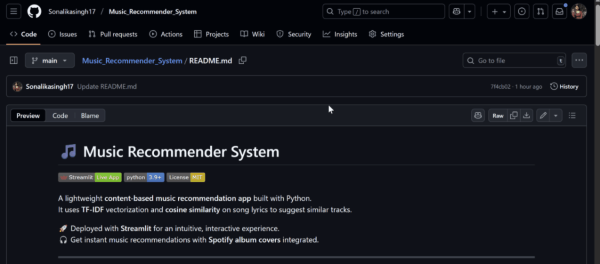

# 🎵 Music Recommender System
[](https://qwcgfsgz3ckvf7s9pnuuyy.streamlit.app/)
[]()
[]()


A lightweight **content-based music recommendation app** built with Python.  
It uses **TF-IDF** vectorization and **cosine similarity** on song lyrics to suggest similar tracks.  

🚀 Deployed with **Streamlit** for an intuitive, interactive experience.  
🎧 Get instant music recommendations with **Spotify album covers** integrated.   

---
## 🎥 Demo



<!--

-->


##  Features
- 🎼 **Content-based Recommendations** using TF-IDF vectorization on lyrics/text features + Cosine Similarity to suggest similar tracks.
- ⚡ **Lightweight & Git-friendly**: avoids committing large files (committed files are computed dynamically at runtime)
- 🎨 **Streamlit UI**: clean design with Spotify album covers
- 🔍 **Interactive Search**: choose songs from dropdown  
 
---

##  Project Structure
```
├── preprocess.py    # Cleans dataset, builds TF-IDF & cosine similarity
├── recommend.py     # Loads data & computes song recommendations
├── main.py          # Streamlit app interface (UI + Spotify album covers)
├── requirements.txt # Python dependencies
├── README.md        # Documentation

```

---

##  Dataset

This project uses the [**Spotify Million Song Dataset (Lyrics Data)**](https://www.kaggle.com/datasets/notshrirang/spotify-million-song-dataset/data) from Kaggle.  

- The dataset contains **song lyrics and metadata** (artist, track, link).  
- In this project:
  - The `text` (lyrics) column is cleaned and preprocessed with **NLTK**.  
  - A **TF-IDF matrix** is built from the cleaned text.  
  - **Cosine similarity** is calculated to recommend top-N similar songs.  

⚠️ Note: Due to size, the dataset itself is **not included in this repository**. Please download it from Kaggle if you want to preprocess it yourself.

---

## 📊 Data Preprocessing & EDA

Before building the recommender, the raw dataset required preprocessing:  

- 🔤 Removed links, numbers & special characters  
- ✂️ Converted text to lowercase, tokenized, and removed stopwords  
- 📐 Built a **TF-IDF matrix** (max 5000 features)  
- 🔗 Computed **cosine similarity** between song vectors  

👉 For detailed preprocessing and exploratory data analysis, see the notebook:  
[`Music_Recommendation_System.ipynb`](./Music_Recommendation_System_using_Python_code_prep_2.ipynb)

---
##  🚀 Quick Start

1. **Clone the Repository**

   ```bash
   git clone https://github.com/Sonalikasingh17/Music_Recommender_System.git
   cd Music_Recommender_System
    ```
2. **Install Dependencies**
   ```bash
   pip install -r requirements.txt
    ```
3. **Download Dataset**

    Download the dataset from Kaggle:

    👉 [**Spotify Million Song Dataset**](https://www.kaggle.com/datasets/notshrirang/spotify-million-song-dataset/data)

4. **Run Preprocessing**
   ```bash
   python preprocess.py
   ```
- This script cleans the dataset and create these files in project folder:
   - `df_cleaned.pkl`
   - `tfidf_matrix.pkl`
   - `cosine_sim.pkl`
 

5. **Launch the Streamlit app**
   ```bash
   streamlit run main.py
    ```
   Open the local URL in your browser to explore the app.
   
---

## ⚡Tips & Customization

- Autocomplete Search Bar: Enhance the select box with st.selectbox(..., help="Type to search...") or use st.text_input() + fuzzy matching for better UX.
- Custom Styling: Modify CSS in main.py to refine recommendation cards (colors, fonts, spacing).
- Data Customization: Replace df['text'] preprocessing logic to work with lyrics, metadata, or genre features.
  
--- 

## 🙏 Acknowledgements

This project was built with ❤️ using **scikit-learn**, **pandas**, **NLTK**, and **Streamlit**,  
inspired by common TF-IDF + cosine similarity recommender patterns for content-based filtering.  
Special thanks to the [Spotify Million Song Dataset](https://www.kaggle.com/datasets/notshrirang/spotify-million-song-dataset/data).
 
--- 

**✨ Enjoy exploring music recommendations with your interactive, lightweight app! ✨**
